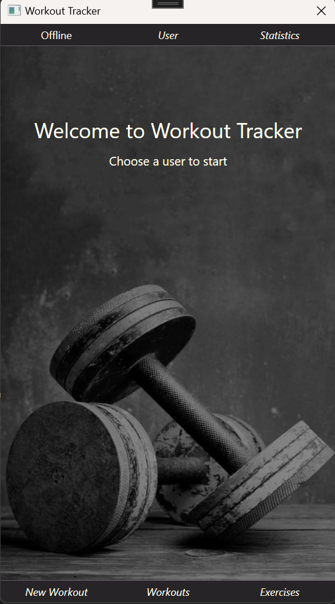
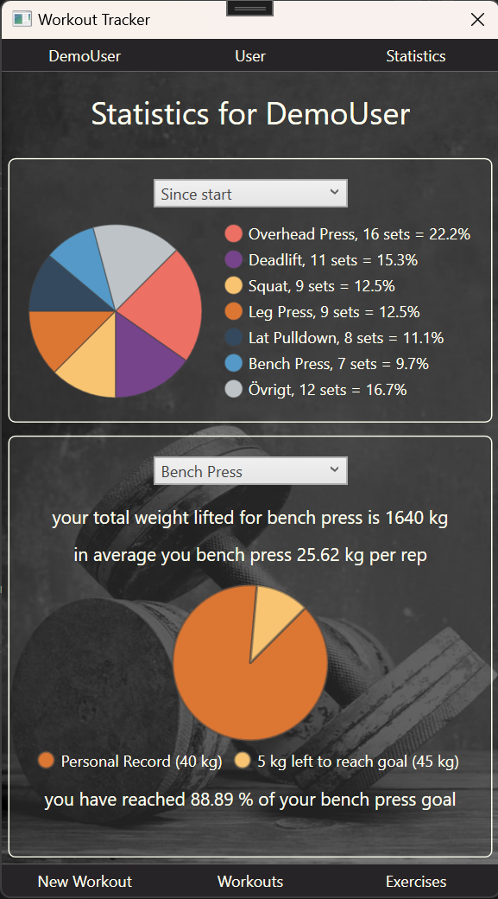
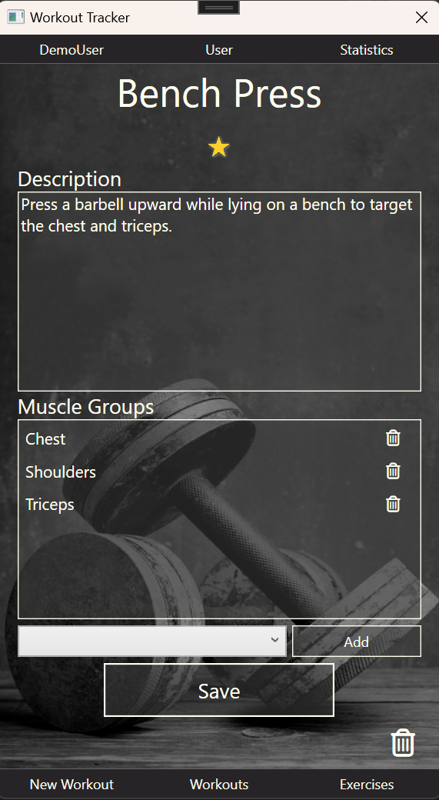
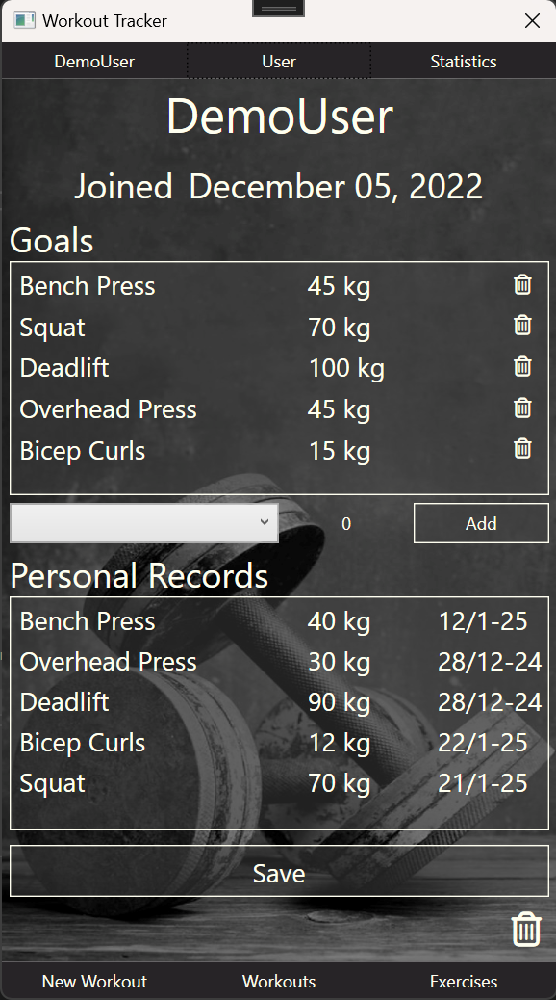
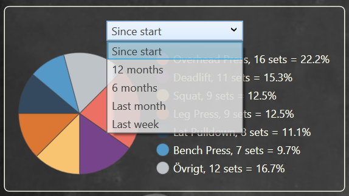
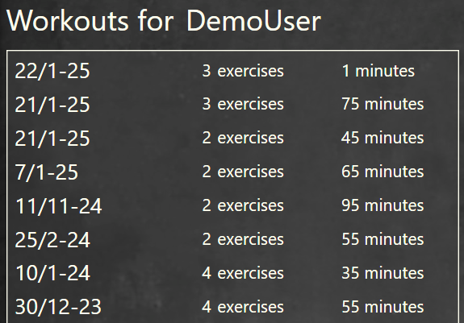
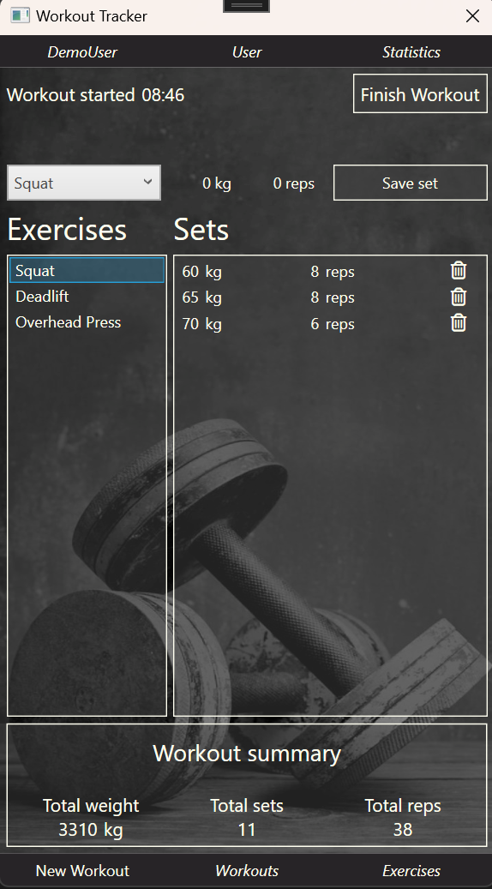
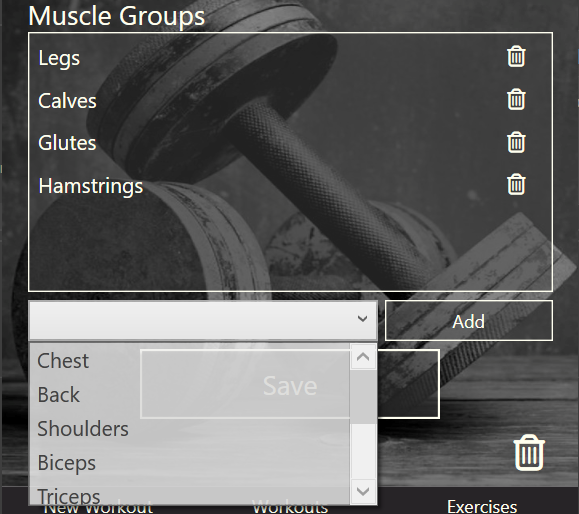

# WorkoutTracker

## Description

WorkoutTracker is a WPF application built using the MVVM design pattern. The application utilizes MongoDB and MongoDB Driver for data storage and management. 



## Features

The application is designed for individuals who train at the gym and offers ability to:
* **Set training goals** - Define weight goals for specific exercises.
* **Log workouts in real time** - Record exercises, weights and repetitions.
* **Analyze statistics** - Visualize training data with pie charts.



At application startup, there is a static colletion of muscle groups as well as a number of predefined exercises. The user can:
* Create, edit and delete exercises.



* View personal information, including weight goals and personal records.



* Personal records are updated automatically during ongoing workouts if a new record is set.
* If a record-setting set i deleted or edited, the record will automatically be removed from the database. As a user you can't eighter create, edit or delete personal records manually.

## Statistics

Two types of pie charts are available for analyzing training data:
1. Set distribution per exercises during a selected period.
2. 


3. Personal records compared to goals for the selected exercise.

## Workouts
* Past workouts can be reviewed, and new ones can be created.



* The workout time is logged automatically at the start.
* Exercises, weights and repetitions are recorded during the session.



* The application continuosly calculates:
    * Total lifted weight
    * Number of setts
    * Number of repetitions
* When the workout is finished, the session duration is logged.

## Installation and Usage

1. Clone the repository:
   ```bash  
   git clone https://github.com/modigida/WorkoutTracker.git
3. Install MongoDB and MongoDB Compass (optional for visual manageement).
4. Build and run the application:
  * The database will be created automatically if it does not already exist.
  * Demo data is generated during the first run to showcase the application´s functionality.



## Technologies

* **.Net WPF** - For the user interface.
* **MVVM** - Design pattern for clear architecture.
* **MongoDB** - Document-based database management.
* **MongoDB Driver** - For database integration.
